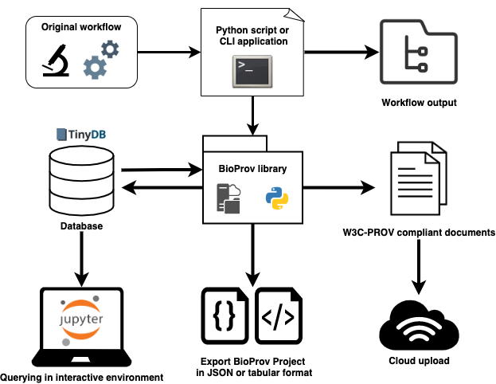

# Summary

In an era where it can be argued that all biology is computational biology [@Markowetz2017],
properly managing computational analyses and data is crucial to
evaluate the findings of *in silico* experiments. A major aspect of best practices in 
scientific computing is managing the **provenance** of data analysis workflows [@Pasquier2017; @wilson2017good].
The World Wide Web Consortium (W3C) Provenance Working Group defines provenance as "a record that describes the people,
institutions, entities, and activities involved in producing, influencing, or delivering a piece of 
data or a thing" [@Groth2013]. 

Therefore, for bioinformatics workflows (BWFs), where there are usually numerous
steps in data processing, capturing and storing provenance rapidly becomes a challenge.
This provenance data should not only be comprehensible to humans, but structured and queryable; 
this is to support reproducibility in present and future research in bioinformatics and
many other fields of scientific research [@Kanwal2017; @Pasquier2017]. A proposed standard for interoperability of provenance
data is the [W3C-PROV data model](https://www.w3.org/TR/prov-dm/), specifically designed to share provenance data across the web
and among diverse applications and systems. Adding provenance to BWFs can be costly to both developers, responsible for
storing information about these workflows, and researchers designing and analyzing workflow results.
While some workflow systems already provide provenance capture, modelling bioinformatics data in compliance with W3C-PROV
is not automatic, requiring a lot of effort from workflow developers and researchers.
We introduce BioProv as a library that aims to facilitate the creation of W3C-PROV compliant documents for BWFs,
automatically capturing the provenance of workflow steps between different users and computing environments. 

## W3C-PROV
The W3C-PROV recommendation is endorsed by the [World Wide Web Consortium (W3C)](https://www.w3.org/Consortium), the leading global community for web standards.
It divides provenance data into three separate views (\autoref{fig:w3c-prov}): the data flow view, comprised of **entities**, that are any physical, digital
or conceptual *thing*; the process flow view, that focuses on **activities**, that are *processes* that happen over time and act upon or with
entities, either by consuming, processing, using, or generating them; and the responsibility view, that concerns the assignment of **agents**
that are responsible for entities, activities, or other agents. These three elements of provenance have a set of seven relations between
them, that can be further described by *relation patterns*. For a full introduction to the W3C-PROV standard, we recommend @Groth2013.

{ width=50% }

# Statement of need

BioProv is a Python library for **generating provenance documents of bioinformatics workflows.**
The challenge of provenance capture in the field of bioinformatics has been characterized and is standing for more than a decade [@Stevens2007].
Presently, there are many freely available tools for managing provenance through workflow systems [@afgan2018galaxy; @hull2006taverna; @Vivian2017; @Koster2012; @DiTommaso2017] and
provenance systems for capturing and storing provenance data from workflow scripts [@Silva2018; @Khan2019].
Several studies have been able to implement solutions that model BWFs and adequately capture and store provenance data [@Ocana2014; @Ocana2015; @DePaula2013].
However, to the best of our knowledge, there is not yet any software library that *specializes* in capturing the provenance of BWFs.
In the case of workflow management systems, they provide execution reports such as execution trace or graph, but these documents are not W3C-PROV compliant and/or
are not serializable, or the collection of domain-specific information must be manually designed by the user with an *ad hoc* approach.
Domain-specific data are particularly relevant in BWFs, as they can be used to help researchers make decisions and steer workflow parameters during runtime [@Costa2013].
They refer to metadata that are characteristic of biological data formats, e.g. the distribution of the length of sequences in a nucleotide sequence file, or the number of
nodes in a phylogenetic tree file.
Implementing a system to capture these data can be very costly to both users and developers of BWFs, as most provenance capture software are generic
and do not support, for example, parsing of biological data formats. This may imply the need to either manually develop specific parsing solutions
for the files involved or to create database schemas that support domain-specific data. BioProv attempts
to fill this gap, by providing features that support the specificities of bioinformatics applications and allow
the automatic capture of provenance data and generation of documents in a W3C-PROV compliant format.

# Features and data modelling

## Overview

BioProv represents the provenance elements of a BWF into a class 
called `Project`, that represents the execution of a bioinformatics workflow (a sequence of programs) using a particular
dataset. An instance of `Project` is composed by related samples, files and programs that are represented by
corresponding classes from the BioProv library. The `Project` class has specific methods that allow the user to specify the relationships between objects, such
as the association between a file and a sample or program.
Projects also carry information about agents, *i.e.* users and computing environments used to execute programs.
In the context of BioProv, a "Project" is distinct from a "Workflow"
in the sense that a Project refers to a particular set of samples and files and associated programs, while a Workflow refers to a sequence of programs that
can be run on a set of adequate input files. A user can therefore use the same workflow in many projects.
Because they are serializable in JSON and tabular formats, BioProv objects can be stored and shared across computing environments, and can be exported as W3C-PROV compliant documents,
allowing better integration with web systems. The library can be used interactively, in an environment such as Jupyter [@ragan2014jupyter],
or from the application's command line interface (CLI). The CLI component of BioProv allows users to quickly launch custom workflows from the command line using
the `bioprov <workflow_name>` command. 

{ width=100% }

BioProv uses the BioPython [@Cock2009] library as a wrapper to parse common bioinformatics file formats, and it supports
several file formats for both [sequence](https://biopython.org/wiki/SeqIO) and [alignment](https://biopython.org/wiki/AlignIO) data, allowing the user
to easily extract domain data without having to write any parsers. Here we present some of the core features of BioProv, but for a more complete introduction,
we recommend the package's [tutorials](https://github.com/vinisalazar/BioProv/blob/master/docs/tutorials/introduction.ipynb) in Jupyter Notebook format, that
can also be launched [via Binder](https://mybinder.org/v2/gh/vinisalazar/bioprov/master?filepath=docs%2Ftutorials%2F), and the [documentation page](https://bioprov.readthedocs.io/).
As example data, we provide five small bacterial genomes and a BLAST database that is a subset of MEGARES [@Lakin2017]. These two datasets can 
be used to demonstrate the installation and to illustrate some of the core features of BioProv.

## Classes

BioProv implements several classes in order to represent provenance data extracted from BWfs.
Its object-oriented design allows users to benefit from the flexibility of working with extensible Python objects, that
are familiar to frameworks such as the libraries in the scientific Python stack: NumPy [@Harris2020], SciPy [@Virtanen2020],
Matplotlib [@Hunter2007], and others. The five main classes are:

* `Project`: The higher-level structure that represents core project information, like samples, files, and programs.
* `Sample`: Describes biological samples. Contains collections of files and programs, and can group any sample attributes,
  such as collection date, collection site, type of sample (soil, water, tissue, etc.).
* `File`: Describes computer files that may be associated with a Sample or Project.
* `Program`: Describes programs that process and create files. Instances of `Program` are composed by instances
of the `Parameter` and `Run` classes (the latter representing a program execution).
* `Environment`: Describes an environment that was used to run a program, including environment variables
and library versions. Users do not need to worry about specifying this information, it is automatically collected by the
library.

A `Project` instance is the top-level object in the BioProv library. It is composed by **Samples**,
**Files**, and **Programs**. A `Sample` instance represents any biological sample, its attributes, and it's composed
by **Files** and **Programs** that are associated with that particular sample. **Files** and **Programs** are associated with
the **Project** when they contain or process information from multiple samples. In the provenance data model, instances
of the `Project`, `Sample`, and `File` classes are represented as entities,
and instances of `Program` are represented as activities. Instances of `Environment` are represented as agents that
act on behalf of the current user.

![Class diagram showing composition relationships between classes in the BioProv library. Instances of the Project, Sample and File
classes (in yellow) are represented as entities in the provenance data model, while instances of the Program class (in blue)
are represented as activities, and instances of the Environment class (in orange) are represented as agents. The Parameter
and Run classes are auxiliary classes that compose the Program class. Diamond symbols represent composition relationships. The filled
diamond symbol indicates that an instance of Run must be necessarily associated with an instance of Environment.
\label{fig:classes}](figures/classes.png){ width=75% }

BioProv detects the current user and environment variables and stores them alongside the Project;
each Program, when executed, is automatically associated with the current computing environment (Figure \autoref{fig:classes}). 
This way, BioProv can represent which execution is associated with each user and environment, allowing for traceable collaborative work.

These five classes constitute the basis of a BioProv project. The library captures provenance data through instances of these classes.
For Samples, it stores the sample's attributes, a collection of files, and a collection of programs.
For both Files and Programs, relevant information is automatically captured, such as the start and end time of each program execution and file size of each file. 
Files containing biological sequences that are supported by BioPython can be parsed with the **SeqFile** class.
This class inherits from File and can extract metadata about the file contents, such as number of sequences,
number of base pairs, GC content (if it is a nucleotide file), and other metrics. This feature allows users to extract
domain data for their provenance documents by using parsers available in BioPython.

Programs in BioProv can be created manually or loaded as a preset. BioProv offers a few preset programs for common bioinformatics
tasks, such as sequence alignment search, multiple sequence alignment, gene prediction and quantification of gene expression.
Running a program with BioProv instead of directly from the command-line automatically captures provenance information
for that execution.
Some of the included programs are:

* **BLAST+:** sequence alignment search [@camacho2009blast]
* **Diamond:** sequence alignment search [@Buchfink2014]
* **MAFFT:** multiple sequence alignment [@Katoh2005]
* **Muscle:** multiple sequence alignment [@Edgar2004]
* **Prodigal:** prokaryotic gene prediction [@Hyatt2010]

Users can create their own presets with either the Program class or the `PresetProgram` class, that inherits from `Program`
and possesses additional methods for batch execution. To manually create programs (that are not presets), the user should
create the program as it is called from the command line, and add **Parameters** to it. A `Parameter` is another BioProv class
that represents specific parameters associated with a program. Presets contain parameters specific to that program.
Parameters can be added to the command string that will be evaluated on the system's shell, by means of Python's
[`subprocess` module](https://docs.python.org/3/library/subprocess.html). For a more complete walkthrough of how to build programs
and add them to the workflow, please refer to the [tutorials](https://github.com/vinisalazar/BioProv/blob/master/docs/tutorials/introduction.ipynb).
Additionally, workflow presets can be created. Workflow presets are a sequence of programs which are to be executed on a project's
files. These presets can then be run using the library's CLI, as their command-line arguments and parser are constructed
automatically.

## Workflow execution with BioProv

To set up a workflow with BioProv to capture provenance data, users must either write a Python
script and replace usual program calls with BioProv code, or launch custom or preexisting preset workflows from the
CLI. Again, the [tutorials](https://github.com/vinisalazar/BioProv/blob/master/docs/tutorials/introduction.ipynb)
and [documentation page](https://bioprov.readthedocs.io/) are the best resources on how to do this. Once this is done,
data must be imported as a BioProv project so the workflow can be executed. In the following section, we provide a brief
demonstration of how to import data and run programs.


### Importing data
There are a few ways to import and export data with BioProv. If a project has not been previously imported, the most convenient way to import it is by
generating a table containing one sample per row, and columns with the path to each file associated with that sample.
Columns that are not files will be processed as sample attributes. For example, assume the following table:

| sample-id 	| assembly        	| report       	| source   	|
|-----------	|-----------------	|--------------	|----------	|
| sample_1  	| contigs_1.fasta 	| report_1.txt 	| seawater 	|
| sample_2  	| contigs_2.fasta 	| report_2.txt 	| soil     	|

The `sample-id` column is our index, *i.e.* each sample is identified by it.
The `assembly` column contains the path to the genome assembly of each sample (therefore, a "sequence file").
The `report` column points to a plain text file contaning the assembly report (therefore, a "file").
The other columns will be parsed as sample attributes. This can be easily done with the `read_csv()` function:

```python
In [1]: import bioprov as bp

In [2]: project = bp.read_csv("myTable.csv",
                              file_cols="report",
                              sequencefile_cols="assembly",
                              tag="myProject",
                              import_data=True)
```

The table from which the data was sourced is automatically added as a Project file:

```python
In [3]: project.files
Out[3]: {'project_csv': /home/user/myProject/myTable.csv}
```

And Samples are created with associated files and attributes:

```python
In [4]: project["sample_1"]
Out[4]: Sample sample_1 with 2 file(s).

In [5]: project["sample_1"].files
Out[5]: 
{'report': /home/user/myProject/report_1.txt,
 'assembly': /home/user/myProject/contigs_1.fasta}

In [6]: project["sample_1"].attributes                                                                                                                                                                           
Out[6]: {'source': 'seawater'}
```

Sequence metadata is extracted from sequence files, as set by the `import_data=True` parameter:

```python
In [7]: project["sample_1"].files["assembly"].GC                                                                                                                                                                
Out[7]: 0.36442
```

To run a program using BioProv, it must be added to the project or to a sample. We can use the preset `prodigal` program
to illustrate this. Prodigal runs a gene prediction algorithm for prokaryotic genomes, and creates three output files:

Now that the project is loaded, the user can add new files, samples and programs. Programs can run and execution provenance
is captured (such as **stdout** and **stderr**, start and end time, and files involved).

```python
In [8]: from bioprov.programs import prodigal                                                                                                                                                                                              

In [9]: with project["sample_1"] as sample: 
            sample.add_programs(prodigal(sample))
            sample.run_programs()
```

To export the project, there are a few options. The user can either:

   * export the project in a tabular format such as the one presented in `myTable.csv`. This omits project information (about programs, for example),
   but preserves information of samples and files. This action is done with the `Project.to_csv()` method;
   * export the project as JSON, the preferred option, as BioProv can deserialize this format back into a `Project` object with all related information; This is done with
   the `Project.to_json()` method;
   * store the project in BioProv's database. BioProv has a builtin document-oriented database, as explained in the following section.

```python
In [10]: project.to_csv()  # exports in tabular format

In [11]: project.to_json()  # exports as JSON

In [12]: project.update_db()  # stores in the BioProv database
Inserting new project 'myProject' in /path/to/bioprov/db.json                                                                                                                                                   
```

## Database system
BioProv has an internal database based on [TinyDB](https://tinydb.readthedocs.io/en/latest/), a document-oriented, pure
Python database. Projects can be loaded by their ID (the `Project.tag` attribute) and can be updated during runtime, by
setting the `Project.auto_update = True` option. Assuming the user has run the previous code example, this could be done in a 
new session:

```python
In [1]: import bioprov as bp

In [2]: project = bp.load_project("myProject")  # call projects by their tag

In [3]: project.auto_update = True
``` 

Now all future modifications to `myProject` will auto-update its record in BioProv's database. 
The database can be managed from BioProv's CLI application.

To **query** an existing project, it must be loaded with the `load_project()` function, and it can then be queried
with Python syntax. The Project's `.samples`, `.files` and `.programs` attributes are Python dictionaries, and can be
manipulated as so. A `Sample` instance will also contain `.files` and `.programs`, and additionally a `.attributes`
dictionary with additional information about the sample (*e.g.* the `source` column in our data table).

```python
In [4]: for k, sample in project.samples.items():
   ...:     # loop over samples
   ...:     source =  sample.attributes['source']
   ...:     print(sample.name, 'is a', source, 'sample.')
   ...:
   ...:     # make conditional statements
   ...:     if 'prodigal' in sample.program.keys():
   ...:         print(sample.name,
   ...:               'contains an instance of the Prodigal program.')
```
```
sample_1 is a seawater sample.
sample_2 is a soil sample.
sample_1 contains an instance of the Prodigal program.
```

Being able to query BioProv objects with Python syntax allows users familiar with the language to create custom queries
and functions, and integrate BioProv into their existing Python applications. Additionally, it is possible to use a tool
such as the [ObjectPath](http://objectpath.org/) library, that implements a query language for semi-structured data, and
is compatible with BioProv's JSON outputs.

## Command line application and workflows

To use the CLI, after installing, type `bioprov` in the system's Shell:

```shell
~/ $ bioprov
usage: bioprov [-h]
               [--show_config | --show_provstore | --create_provstore |
                --show_db | --clear_db | -v | -l]
               {genome_annotation,blastn,kaiju} ...

BioProv command-line application. Choose a command to begin.

optional arguments:
  -h, --help            show this help message and exit
  --show_config         Show location of config file.
  --show_provstore      Show location of ProvStore credentials file.
  --create_provstore    Create ProvStore credentials file.
  --show_db             Show location of database file.
  --clear_db            Clears all records in database.
  -v, --version         Show BioProv version
  -l, --list            List Projects in the BioProv database.

workflows:
  {genome_annotation,blastn,kaiju}
```

The `bioprov --show_db` and `bioprov --list` commands, for example, can be used to show the location of BioProv's
database and list all projects it contains. The `workflows` are preset sequences of programs that can be run directly from the CLI.
They are implemented with BioProv's `Workflow` class and handle the creation of the BioProv project while
running the desired workflow. Users can write their own workflow and the command-line parser will be automatically generated
based on the parameters set by the user. For more information, please refer to BioProv's 
[`workflows` subpackage](https://github.com/vinisalazar/BioProv/tree/master/bioprov/workflows), where preset workflows are stored, or run 
the `bioprov <workflow_name>` command in the CLI for help about a particular workflow. Presently, BioProv workflows are 
limited, serving mainly as a reference for users to write their own workflows; one of the main future goals of the library is to
support a range of common BWFs. We actively encourage users to contribute their workflows by following the 
[contributing guidelines](https://github.com/vinisalazar/BioProv/blob/master/CONTRIBUTING.md) or request one by opening an issue in the repository.

# Provenance documents

To create W3C-PROV documents, BioProv utilizes the PROV library [@Dong2020], and models its native objects onto
the three PROV elements: **entities**, **agents**, and **activities** (@Groth2013 provide a detailed description of PROV concepts).
To do this, a `BioProvDocument` object is created from `project`. A W3C-PROV compatible document is then created, with
associated relationships between PROV elements for each object of the project. BioProv defines one "bundle" for the project, and one 
for each sample and user. Bundles are documents nested within the top-level `BioProvDocument`, used to describe individual entities (for the Sample bundles)
or agents (for the user bundles). Computing environments are also regarded as agents, that **act on behalf of** users through **activities**
(that correspond to BioProv's `Program` instances). By leveraging the PROV library, the resulting document can be exported in a number of ways, such as 
graphical format and [PROV-N](https://www.w3.org/TR/prov-n/) (a human-readable provenance format).

The following code generates the \autoref{fig:project} and a PROV-N record.

```python
In [5]: prov = bp.BioProvDocument(project)

In [6]: prov.write_provn()

In [7]: prov.dot.write_pdf("myProject.pdf")
```


Lastly, **BioProvDocuments** can be uploaded to [ProvStore](https://openprovenance.org/store/), a web service for storage and visualization
of W3C-PROV documents. The credentials to the ProvStore API are set with the `bioprov --create_provstore` command, and a document can be
uploaded with the `upload_to_provstore()` method:

```python
In [8]: prov.upload_to_provstore()
```

This feature enables the immediate publication of provenance documents that have a uniform resource identifier (URI)
through their ProvStore address. Future developments for further supporting the W3C-PROV standard in the field of bioinformatics
should focus on integrating more web services, such as [NCBI Entrez](https://www.ncbi.nlm.nih.gov/Web/Search/entrezfs.html) and
[Wikidata](https://www.wikidata.org/wiki/Wikidata:Main_Page), for continuous improvement of the reproducibility of BWFs.

# Conclusion

We present a software library that allows users to create and run bioinformatics workflows while capturing provenance data
during runtime, that can then be exported as W3C-PROV compliant documents. Provenance data can be imported and exported in
widely-used and web-compatible formats, and this provenance is enriched with domain-specific data without much effort from the user.
BioProv is written entirely in Python, benefitting from numerous existing libraries that complement it,
and its objects can be extended and customized to suit users' needs. This results in a simple, lightweight yet powerful library that
can make Python workflows provenance-aware, setting BioProv as a valuable addition to the ecosystem of
bioinformatics workflow tools.

# Acknowledgements

We would like to thank the funding agencies CNPq, FAPERJ, and CAPES.

# References
