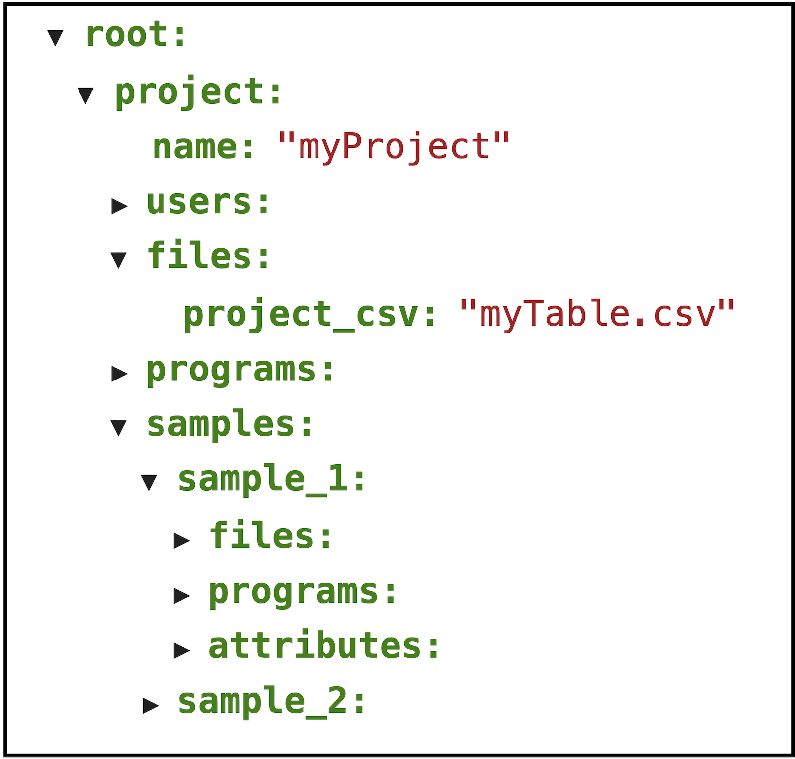
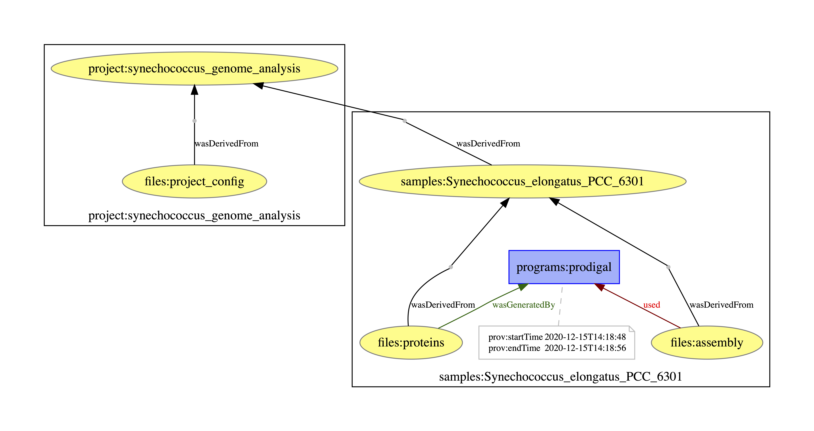

# Summary

In an era where it can be argued that all biology is computational biology [@Markowetz2017],
it is increasingly important to properly manage computational analyses and data in order to
ensure the reproducibility of *in silico* experiments. A major aspect of best practices in 
scientific computing [@wilson2017good] is managing the **provenance** of data. The World Wide Web
Consortium (W3C) Provenance Working Group defines provenance as ["a record that describes the people,
institutions, entities, and activities involved in producing, influencing, or delivering a piece of 
data or a thing"](https://www.w3.org/TR/prov-overview/) [@Groth2013]. 

Therefore, for bioinformatics workflows (BWFs), where there are usually numerous, and many times complex,
steps in data processing, capturing and storing provenance rapidly becomes a challenge.
This provenance data should not only be intelligible to humans, but structured and machine-readable; 
this is fundamental to ensure reproducibility in present and future research in bioinformatics and
many other fields of scientific research [@Kanwal2017; @Pasquier2017]. A proposed standard for interoperability of provenance
data is the [W3C-PROV data model](https://www.w3.org/TR/prov-dm/), specifically designed to share provenance data
across the web. However, modelling BWFs with the W3C-PROV standard can be costly to both 
researchers writing and performing the analyses and developers responsible for storing information about these workflows
in web systems. We introduce BioProv as a library which aims to facilitate the creation of W3C-PROV compliant documents
for BWFs, capturing the provenance of the workflow steps between different users and computing environments.

# Statement of need

BioProv is a Python library for **generating provenance documents of bioinformatics workflows.**
Presently, there are excellent, freely available tools for orchestrating scientific workflows, such as Nextflow,
Snakemake and Toil [@Jackson2020], and others which specialize in capturing and storing provenance data during workflow runtime
[@Silva2018; @Khan2019]. However, to the best of our knowledge, there is not yet any library which specializes in capturing provenance of BWFs.
Some of these workflow management systems provide reports such as execution trace or graph, but theyse reports are not W3C-PROV compatible and/or
are not serializable, and the collection of domain specific information usually must be collected by the user in an *ad hoc* manner.
This can be very costly to both users and developers of BWFs looking to collect provenance data, as much effort can be spent
in modelling these workflows in a satisfactory data structure which can be easily updated during runtime [@DePaula2013]. BioProv attempts
to fill this gap, by providing features which facilitate the capture of W3C-PROV compatible provenance data and support the specificities of
bioinformatics applications.

# Features and data model

## Overview

BioProv is **object-oriented** and **project-based**. It works by modelling the provenance elements of a BWF in a hierarchical, JSON-serializable data structure.
Thus, BioProv objects can be easily stored and shared across computing environments, and can be exported as W3C-PROV compliant documents,
allowing better integration with web systems. It can be used interactively, in an environment such as Jupyter [@ragan2014jupyter],
or from the command line (CLI), as it can be used to quickly write provenance-aware workflows which can be launched using
the `bioprov <workflow_name>` command. BioProv uses the BioPython [@Cock2009] library as a wrapper to parse bioinformatics file formats, as it supports
several file formats for both [sequence](https://biopython.org/wiki/SeqIO) and [alignment](https://biopython.org/wiki/AlignIO) data, allowing the user
to easily extract domain data without having to write any parsers. Here we present some of the core features of BioProv, but for a more complete introduction,
we recommend the package's [tutorials](https://github.com/vinisalazar/BioProv/blob/master/docs/tutorials/introduction.ipynb) in Jupyter Notebook format, which
can also be launched [via Binder](https://mybinder.org/v2/gh/vinisalazar/bioprov/master?filepath=docs%2Ftutorials%2F), and the [documentation page](https://bioprov.readthedocs.io/).

## Classes

BioProv implements five main classes:

* **Project:** Higher level structure which contains core project information. Contains associated samples, files, and programs.
* **Sample:** Describes biological samples. Has attributes and contains associated files and programs.
* **File:** Describes computer files which may be associated with a Sample or Project (i.e. if it is associated with zero, two or more samples).
* **Program:** Describes programs which process and create files.
* **Workflow:** Describes a sequence of programs which are run on project- or sample-level files. Used mostly with the CLI functionality.

A **Project** will be the top-level object in a BioProv workflow. It will contain $n$ biological **Samples** which may have
individually associated **Files** (for example, raw sequence data in FASTQ format) and **Programs**, which are processes that can be run
to create and/or modify files. Files and Programs can also be associated directly with the Project, instead of being associated with a 
particular Sample (\autoref{fig:json}.) BioProv detects the current user and environment variables and stores them alongside the Project;
each Program, when run, is automatically associated with the current computing environment. This way, BioProv can represent which process
is associated with each user and environment, allowing for traceable collaborative work.

## IO and database system

# Provenance documents

Lorem ipsum. This is a reference to \autoref{fig:project}.

# Acknowledgements

We thank CNPq for funding scholarships for all authors.

# References